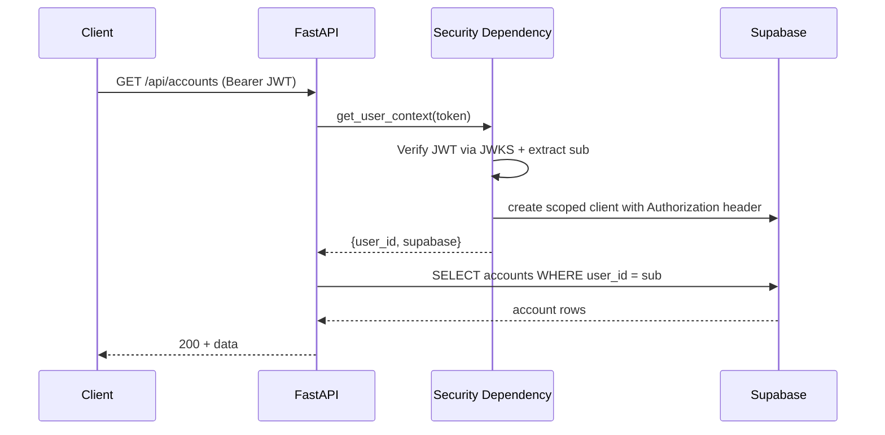
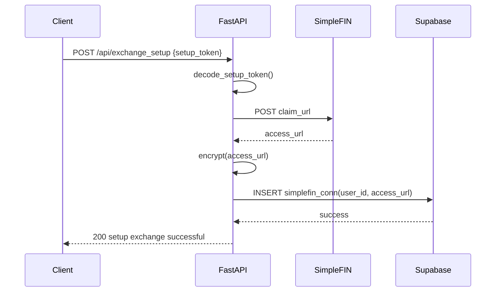
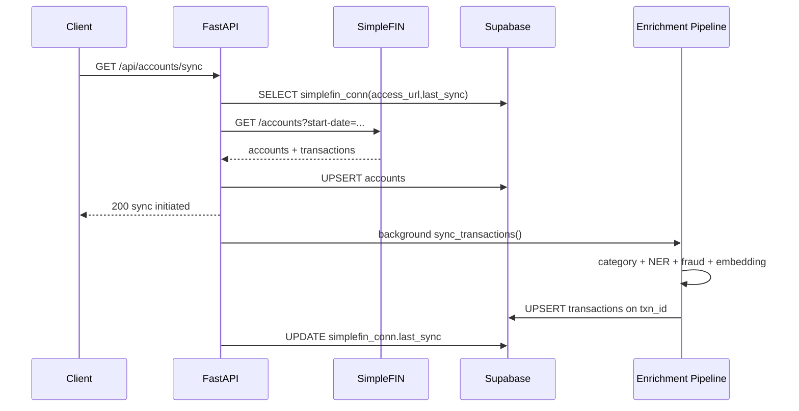
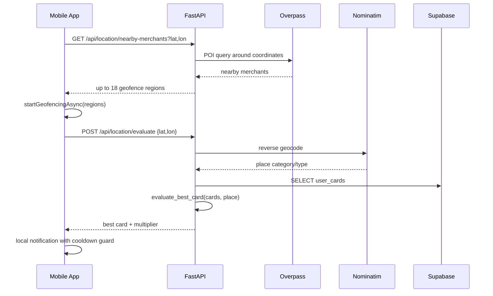
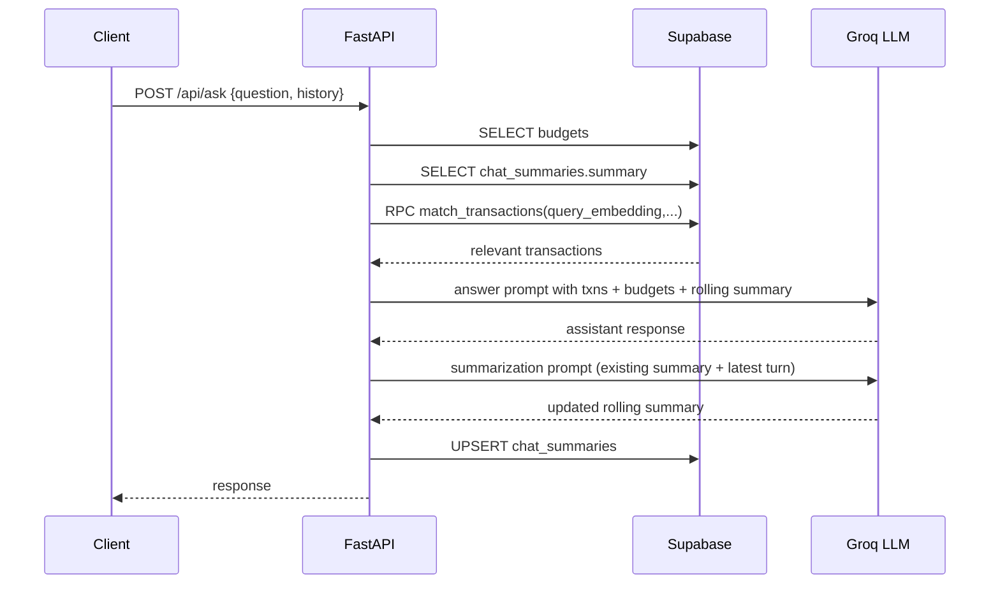

# Swipe Platform Engineering Handbook

Swipe is an AI-first personal finance platform built around four product pillars:

- SwipeSmart: context-aware card recommendations using geofencing and merchant categorization.
- SwipeGuard: transaction anomaly detection with behavioral and rules-based fraud scoring.
- SwipeChat: RAG-style financial assistant with transaction retrieval and rolling memory.
- Live Sync + Smart Categorization: transaction ingestion from SimpleFIN with ML enrichment.

This document is written as a systems-level engineering guide for implementation, operation, and extension.

## 1. Audience And Intent

This README is for:

- Backend engineers working on FastAPI, ML orchestration, and Supabase integration.
- Mobile engineers working on Expo background tasks, auth, and feature surface orchestration.
- Infra and security engineers responsible for auth boundaries, data isolation, and production controls.
- New team members onboarding into architecture, runtime behavior, and failure modes.

Primary goals:

- Explain what the system does and why each subsystem exists.
- Define authoritative contracts between frontend, backend, and database.
- Document operational behavior under normal and degraded conditions.
- Reduce ambiguity for future changes and code reviews.

## 2. Product And System Objectives

### 2.1 Functional Objectives

- Securely connect bank data using SimpleFIN setup token flow.
- Normalize account/transaction records under a user-scoped tenancy model.
- Enrich transactions with category, location, embedding, and fraud telemetry.
- Provide context-aware card recommendations based on real-world location events.
- Serve accurate, concise conversational analytics through grounded retrieval.

### 2.2 Non-Functional Objectives

- Strong tenant isolation with JWT verification + RLS defense-in-depth.
- Idempotent write behavior for sync and retry safety.
- Low interaction latency for chat and dashboard paths.
- Predictable degradation when external dependencies fail.
- Clear observability and incident response playbooks.

## 3. Current Stack

- Mobile App: React Native (Expo), TypeScript.
- Backend API: FastAPI (Python).
- Database/Auth: Supabase Postgres + Supabase Auth + pgvector.
- ML/AI Components:
  - TF-IDF + LogisticRegression category classifier.
  - Local BERT NER model for location extraction.
  - IsolationForest fraud detector with behavioral features.
  - SentenceTransformer embeddings for semantic retrieval.
  - Groq-hosted LLM completions for assistant responses and memory summarization.
- External Integrations:
  - SimpleFIN for bank account/transaction ingestion.
  - Overpass API for nearby merchant POI discovery.
  - Nominatim reverse geocoding for merchant context.

## 4. Repository Topology

Top-level:

- index.html: lightweight web test harness for auth, sync, and chat calls.
- backend/: API, ML orchestration, data access, and security.
- mobile/: Expo client application.
- leaks-report.json: local report artifact.

Backend:

- backend/app.py: FastAPI app bootstrap and middleware registration.
- backend/config/settings.py: env loading, shared clients, model loading.
- backend/config/security.py: token extraction, JWT verification, user/admin context.
- backend/database/db.py: data access layer and sync persistence logic.
- backend/database/chat_summaries.sql: rolling summary table and RLS migration script.
- backend/routes/: API route modules.
- backend/models/: categorization, chatbot, fraud, NER models.
- backend/utils/: SimpleFIN, embeddings, cryptography, date helpers, location evaluation.

Mobile:

- mobile/App.tsx: root providers and location tracking gate.
- mobile/src/context/: auth/data/settings context providers.
- mobile/src/services/: API client, Supabase client, location task definitions.
- mobile/src/hooks/useLocationTracking.ts: permission flow + task start/stop.
- mobile/src/screens/: dashboard, chat, fraud, swipesmart, auth/settings screens.

## 5. Architecture Overview

### 5.1 Logical Layers

- Presentation Layer:
  - Mobile app and local web harness.
- API Layer:
  - FastAPI route handlers validating inputs and composing service calls.
- Domain/Service Layer:
  - Sync, enrichment, recommendation, fraud scoring, assistant orchestration.
- Persistence Layer:
  - Supabase tables, vector retrieval RPC, RLS policies.
- External Provider Layer:
  - SimpleFIN, Overpass, Nominatim, Groq.

### 5.2 System Characteristics

- API is request-driven, with background tasks used for async persistence during sync.
- Security model is bearer token auth + request-scoped Supabase client + RLS.
- Data access patterns are user-scoped read/write with explicit user_id filters.
- Write patterns favor upsert for idempotency and duplicate suppression.

## 6. Service Boundaries And Responsibilities

### 6.1 Auth And Security Boundary

File focus:

- backend/config/security.py

Responsibilities:

- Extract Bearer token from Authorization header.
- Validate JWT against Supabase JWKS (ES256).
- Build user-scoped Supabase client.
- Derive admin privilege from role/app_metadata/user_metadata claims.
- Enforce privileged route access through require_admin_context dependency.

### 6.2 Bank Sync Boundary

File focus:

- backend/routes/token_exchange.py
- backend/routes/bank_routes.py
- backend/utils/simplefin_service.py
- backend/database/db.py

Responsibilities:

- Claim setup token to obtain durable access URL.
- Encrypt and persist connection data.
- Fetch accounts and transaction payloads from SimpleFIN.
- Persist account records and queue transaction enrichment/storage.
- Track last_sync for incremental sync windows.

### 6.3 Enrichment Boundary

File focus:

- backend/models/categorization.py
- backend/models/ner.py
- backend/utils/embeddings.py
- backend/models/fraud_detector.py
- backend/database/db.py

Responsibilities:

- Infer category from merchant strings.
- Extract city/state context from unstructured description text.
- Generate semantic embedding vectors.
- Score transactions for anomaly/fraud risk.

### 6.4 Assistant Boundary

File focus:

- backend/routes/chatbot_routes.py
- backend/models/chatbot.py
- backend/database/db.py

Responsibilities:

- Build retrieval query from user question + recent history.
- Retrieve relevant transactions by vector and fallback paths.
- Inject budget context and rolling summary memory.
- Produce constrained assistant response.
- Update rolling summary after each answer.

### 6.5 SwipeSmart Location Boundary

File focus:

- mobile/src/services/LocationService.ts
- mobile/src/hooks/useLocationTracking.ts
- backend/routes/card_routes.py
- backend/utils/location_evaluator.py

Responsibilities:

- Register location seed background task.
- Discover nearby merchant POIs and seed geofences.
- Evaluate best card on geofence entry.
- Enforce local cooldown and dispatch notification.

## 7. End-To-End Runtime Flows

### 7.1 Authentication Flow

1. User authenticates via Supabase from mobile or web harness.
2. Client stores session token and sends it in Authorization header.
3. Backend verifies token against JWKS and builds scoped client.
4. Route handlers execute with per-request user context.

### 7.2 Setup Token Exchange Flow

1. Client POSTs setup_token to /api/exchange_setup.
2. Backend decodes token or accepts direct claim URL.
3. Backend claims setup token via SimpleFIN endpoint.
4. Returned access URL is encrypted with Fernet and stored in simplefin_conn.

Failure points:

- Malformed token.
- Invalid/expired claim URL.
- External network timeout.

### 7.3 Accounts Sync Flow

1. Client calls GET /api/accounts/sync.
2. Backend loads decrypted access_url + last_sync.
3. Backend requests SimpleFIN accounts and recent transactions.
4. Backend upserts account records.
5. Background task enriches and upserts transactions.
6. Background task updates last_sync.

Design properties:

- Immediate API response while heavy write runs in background.
- Upsert keyed by txn_id to prevent duplicate rows on retries.

### 7.4 SwipeSmart Geofence Flow

1. App starts MERCHANT_SEED_TASK when auth is present and toggle enabled.
2. Seed task runs every ~150m movement and calls backend nearby-merchants endpoint.
3. Backend queries Overpass and returns up to 18 POIs.
4. App atomically replaces geofence set.
5. On geofence entry, app calls /api/location/evaluate.
6. Backend reverse geocodes location and evaluates best card against saved wallet.
7. App emits notification if commercial + best card present + cooldown allows.

### 7.5 SwipeChat Flow With Rolling Summary

1. Client sends question + recent chat history to /api/ask.
2. Backend loads budgets and current rolling summary from chat_summaries.
3. Backend performs transaction retrieval (vector + fallback).
4. Backend prompts LLM with budgets, transactions, and rolling summary memory.
5. Backend returns answer.
6. Backend updates rolling summary via summarization pass and upsert.

### 7.6 Fraud Detection Flow

Sync path:

1. During transaction upsert pipeline, each transaction is scored.
2. Risk score + feature breakdown are stored in transactions table.

Training path:

1. /api/train-fraud-model is admin-protected.
2. Endpoint trains global model from non-fraud-confirmed historical transactions.
3. Model/scaler/profiles artifacts persisted to disk.

### 7.7 Sequence Diagrams

#### Authentication + User-Scoped Query



#### Setup Token Exchange



#### Accounts Sync + Background Enrichment



#### SwipeSmart Geofence Recommendation



#### SwipeChat Retrieval + Rolling Memory



## 8. API Contract Reference

Base URL:

- http://localhost:8000 (local default)

Auth rules:

- Public: GET /
- Protected: all /api/* routes unless explicitly noted.
- Admin-protected: POST /api/train-fraud-model

### 8.1 GET /

Purpose:

- health check.

Response:

```json
{ "message": "Hello World" }
```

### 8.2 POST /api/exchange_setup

Purpose:

- claim setup token and persist encrypted SimpleFIN access URL.

Body:

```json
{ "setup_token": "..." }
```

Response:

```json
{ "message": "Setup exchange successful" }
```

### 8.3 GET /api/accounts/sync

Purpose:

- fetch accounts and queue transaction sync background tasks.

Response:

```json
{ "success": "Account sync initiated. Transactions will be updated in the background." }
```

### 8.4 GET /api/accounts

Purpose:

- list user-linked accounts.

### 8.5 GET /api/transactions?acc_id=...

Purpose:

- list account transactions for current user.

### 8.6 GET /api/transactions/fraud

Purpose:

- list fraud-flagged transactions for current user.

### 8.7 POST /api/transactions/update-fraud-status

Purpose:

- mark a flagged transaction as confirmed fraud or safe.

Query params:

- txn_id
- is_confirmed_fraud

### 8.8 Budget Endpoints

- GET /api/transactions/budgets
- POST /api/transactions/create-budget
- PUT /api/transactions/budgets/{budget_id}
- DELETE /api/transactions/budgets/{budget_id}

### 8.9 Card Wallet + Location Endpoints

- GET /api/user/cards
- POST /api/user/cards
- GET /api/location/nearby-merchants
- POST /api/location/evaluate

### 8.10 Chat Endpoint

- POST /api/ask

Body:

```json
{
  "question": "How can I cut down on spending?",
  "history": [
    { "role": "user", "content": "..." },
    { "role": "assistant", "content": "..." }
  ]
}
```

### 8.11 Fraud Model Endpoints

- POST /api/train-fraud-model (admin only)
- POST /api/score-transaction (authenticated)

## 9. Data Model And Persistence Contracts

Expected core tables:

- simplefin_conn
- accounts
- transactions
- budgets
- user_cards
- chat_summaries

### 9.1 chat_summaries Migration

Use:

- backend/database/chat_summaries.sql

This migration creates table + RLS policies for:

- select own summary
- insert own summary
- update own summary

### 9.2 Vector Retrieval RPC

The assistant expects an RPC function named:

- match_transactions

Expected args:

- query_embedding
- match_threshold
- match_count
- p_user_id

Expected behavior:

- returns semantically similar user transactions only.

### 9.3 Idempotency Strategy

- accounts upsert on acc_id.
- transactions upsert on txn_id.
- wallet cards replaced by delete+insert scoped to user.
- rolling summary upsert on user_id.

### 9.4 Complete SQL DDL Templates

These templates are intended for Supabase Postgres and aligned to current application behavior.

```sql
-- Required extension for vector embeddings
create extension if not exists vector;

-- 1) simplefin connection
create table if not exists public.simplefin_conn (
  id bigserial primary key,
  user_id uuid not null references auth.users(id) on delete cascade,
  access_url text not null,
  last_sync bigint,
  created_at timestamptz not null default now(),
  updated_at timestamptz not null default now()
);

create unique index if not exists idx_simplefin_conn_user
on public.simplefin_conn(user_id);

-- 2) accounts
create table if not exists public.accounts (
  id bigserial primary key,
  acc_id text not null,
  user_id uuid not null references auth.users(id) on delete cascade,
  sfc_id bigint references public.simplefin_conn(id) on delete set null,
  provider text,
  acc_type text,
  currency text,
  balance double precision,
  available_balance double precision,
  created_at timestamptz not null default now(),
  updated_at timestamptz not null default now(),
  constraint uq_accounts_acc_id unique (acc_id)
);

create index if not exists idx_accounts_user on public.accounts(user_id);

-- 3) transactions
create table if not exists public.transactions (
  id bigserial primary key,
  user_id uuid not null references auth.users(id) on delete cascade,
  txn_id text not null,
  acc_id text not null,
  amount double precision not null,
  merchant text,
  description text,
  category text,
  city text,
  state text,
  txn_date timestamptz,
  embedding vector(384),
  is_flagged_fraud boolean default false,
  is_confirmed_fraud boolean,
  risk_score double precision,
  feature_breakdown jsonb,
  created_at timestamptz not null default now(),
  updated_at timestamptz not null default now(),
  constraint uq_transactions_txn_id unique (txn_id)
);

create index if not exists idx_transactions_user_acc_date
on public.transactions(user_id, acc_id, txn_date desc);

create index if not exists idx_transactions_user_fraud
on public.transactions(user_id, is_flagged_fraud);

-- Optional ivfflat index for vector search (requires ANALYZE and adequate row count)
create index if not exists idx_transactions_embedding_ivfflat
on public.transactions using ivfflat (embedding vector_cosine_ops)
with (lists = 100);

-- 4) budgets
create table if not exists public.budgets (
  id uuid primary key default gen_random_uuid(),
  user_id uuid not null references auth.users(id) on delete cascade,
  name text not null,
  amount double precision not null check (amount > 0),
  category text not null,
  period text not null,
  created_at timestamptz not null default now(),
  updated_at timestamptz not null default now()
);

create index if not exists idx_budgets_user on public.budgets(user_id);

-- 5) user cards
create table if not exists public.user_cards (
  id bigserial primary key,
  user_id uuid not null references auth.users(id) on delete cascade,
  card_name text not null,
  issuer text,
  last_four text,
  card_network text,
  logo_url text,
  reward_multipliers jsonb not null default '{}'::jsonb,
  reward_type text,
  annual_fee double precision not null default 0,
  created_at timestamptz not null default now(),
  updated_at timestamptz not null default now()
);

create index if not exists idx_user_cards_user on public.user_cards(user_id);

-- 6) rolling chat summaries
create table if not exists public.chat_summaries (
  user_id uuid primary key references auth.users(id) on delete cascade,
  summary text not null default '',
  updated_at timestamptz not null default now()
);
```

### 9.5 RLS Policies For All User Tables

```sql
alter table public.simplefin_conn enable row level security;
alter table public.accounts enable row level security;
alter table public.transactions enable row level security;
alter table public.budgets enable row level security;
alter table public.user_cards enable row level security;
alter table public.chat_summaries enable row level security;

-- simplefin_conn
drop policy if exists simplefin_conn_select_own on public.simplefin_conn;
drop policy if exists simplefin_conn_insert_own on public.simplefin_conn;
drop policy if exists simplefin_conn_update_own on public.simplefin_conn;
drop policy if exists simplefin_conn_delete_own on public.simplefin_conn;
create policy simplefin_conn_select_own on public.simplefin_conn for select using (auth.uid() = user_id);
create policy simplefin_conn_insert_own on public.simplefin_conn for insert with check (auth.uid() = user_id);
create policy simplefin_conn_update_own on public.simplefin_conn for update using (auth.uid() = user_id) with check (auth.uid() = user_id);
create policy simplefin_conn_delete_own on public.simplefin_conn for delete using (auth.uid() = user_id);

-- accounts
drop policy if exists accounts_select_own on public.accounts;
drop policy if exists accounts_insert_own on public.accounts;
drop policy if exists accounts_update_own on public.accounts;
drop policy if exists accounts_delete_own on public.accounts;
create policy accounts_select_own on public.accounts for select using (auth.uid() = user_id);
create policy accounts_insert_own on public.accounts for insert with check (auth.uid() = user_id);
create policy accounts_update_own on public.accounts for update using (auth.uid() = user_id) with check (auth.uid() = user_id);
create policy accounts_delete_own on public.accounts for delete using (auth.uid() = user_id);

-- transactions
drop policy if exists transactions_select_own on public.transactions;
drop policy if exists transactions_insert_own on public.transactions;
drop policy if exists transactions_update_own on public.transactions;
drop policy if exists transactions_delete_own on public.transactions;
create policy transactions_select_own on public.transactions for select using (auth.uid() = user_id);
create policy transactions_insert_own on public.transactions for insert with check (auth.uid() = user_id);
create policy transactions_update_own on public.transactions for update using (auth.uid() = user_id) with check (auth.uid() = user_id);
create policy transactions_delete_own on public.transactions for delete using (auth.uid() = user_id);

-- budgets
drop policy if exists budgets_select_own on public.budgets;
drop policy if exists budgets_insert_own on public.budgets;
drop policy if exists budgets_update_own on public.budgets;
drop policy if exists budgets_delete_own on public.budgets;
create policy budgets_select_own on public.budgets for select using (auth.uid() = user_id);
create policy budgets_insert_own on public.budgets for insert with check (auth.uid() = user_id);
create policy budgets_update_own on public.budgets for update using (auth.uid() = user_id) with check (auth.uid() = user_id);
create policy budgets_delete_own on public.budgets for delete using (auth.uid() = user_id);

-- user_cards
drop policy if exists user_cards_select_own on public.user_cards;
drop policy if exists user_cards_insert_own on public.user_cards;
drop policy if exists user_cards_update_own on public.user_cards;
drop policy if exists user_cards_delete_own on public.user_cards;
create policy user_cards_select_own on public.user_cards for select using (auth.uid() = user_id);
create policy user_cards_insert_own on public.user_cards for insert with check (auth.uid() = user_id);
create policy user_cards_update_own on public.user_cards for update using (auth.uid() = user_id) with check (auth.uid() = user_id);
create policy user_cards_delete_own on public.user_cards for delete using (auth.uid() = user_id);

-- chat_summaries
drop policy if exists chat_summaries_select_own on public.chat_summaries;
drop policy if exists chat_summaries_insert_own on public.chat_summaries;
drop policy if exists chat_summaries_update_own on public.chat_summaries;
create policy chat_summaries_select_own on public.chat_summaries for select using (auth.uid() = user_id);
create policy chat_summaries_insert_own on public.chat_summaries for insert with check (auth.uid() = user_id);
create policy chat_summaries_update_own on public.chat_summaries for update using (auth.uid() = user_id) with check (auth.uid() = user_id);
```

### 9.6 Vector Retrieval RPC Template

```sql
create or replace function public.match_transactions(
  query_embedding vector(384),
  match_threshold float,
  match_count int,
  p_user_id uuid
)
returns table (
  id bigint,
  user_id uuid,
  txn_id text,
  acc_id text,
  amount double precision,
  merchant text,
  description text,
  category text,
  city text,
  state text,
  txn_date timestamptz,
  similarity float
)
language sql
stable
as $$
  select
    t.id,
    t.user_id,
    t.txn_id,
    t.acc_id,
    t.amount,
    t.merchant,
    t.description,
    t.category,
    t.city,
    t.state,
    t.txn_date,
    1 - (t.embedding <=> query_embedding) as similarity
  from public.transactions t
  where
    t.user_id = p_user_id
    and t.embedding is not null
    and 1 - (t.embedding <=> query_embedding) >= match_threshold
  order by t.embedding <=> query_embedding
  limit greatest(match_count, 1);
$$;
```

## 10. Security Posture

### 10.1 Authentication Controls

- Bearer token required for protected routes.
- Token signature and expiry validated.
- User context created per request; no global user state.

### 10.2 Authorization Controls

- User-level operations constrained by user_id filters.
- Admin-only route protection for global fraud training.
- Additional isolation enforced via database RLS.

### 10.3 Secrets And Sensitive Data

- SimpleFIN access URL encrypted with Fernet before persistence.
- Env vars required for Supabase and LLM provider keys.
- Never log access tokens, decrypted URLs, or raw secret values.

### 10.4 CORS Strategy

- Development mode uses explicit localhost origins only.
- Non-development mode requires CORS_ORIGINS allowlist.
- Wildcard origins are intentionally disallowed in production mode.

## 11. Reliability, Latency, And Scaling

### 11.1 Dominant Latency Sources

- External APIs (SimpleFIN, Overpass, Nominatim, Groq).
- Supabase network and query latency.
- Local model inference and serialization overhead.

### 11.2 Scalability Levers

- Increase Uvicorn worker count for concurrent API handling.
- Offload sync/enrichment tasks to durable queue workers for larger volumes.
- Add selective indexes for query-heavy paths:
  - transactions(user_id, acc_id, txn_date)
  - transactions(user_id, is_flagged_fraud)
  - budgets(user_id)
  - user_cards(user_id)

### 11.3 Failure Mode Philosophy

- Fail closed on auth/authorization paths.
- Fail soft on optional rolling summary persistence to keep chat responsive.
- Return user-safe errors; avoid leaking internals.

### 11.4 SLI And SLO Targets

#### Availability And Correctness SLOs

| Service Surface | SLI Definition | Target | Window | Error Budget |
|---|---|---|---|---|
| Authenticated API requests | 2xx/3xx response ratio for non-client-fault requests | 99.90% | 30 days | 43m 49s |
| Chat answer success | /api/ask requests returning non-empty response | 99.50% | 30 days | 3h 39m |
| Sync start acceptance | /api/accounts/sync returns success payload | 99.90% | 30 days | 43m 49s |
| Fraud status update correctness | update-fraud-status writes matching row count >= 1 | 99.95% | 30 days | 21m 54s |
| SwipeSmart evaluate success | /api/location/evaluate 2xx ratio | 99.50% | 30 days | 3h 39m |

#### Latency SLOs (P95 Unless Stated)

| Endpoint | Latency Objective | Notes |
|---|---|---|
| GET /api/accounts | <= 300 ms | warm DB path |
| GET /api/transactions | <= 700 ms | account-specific page fetch |
| GET /api/transactions/fraud | <= 500 ms | filtered flagged set |
| POST /api/ask | <= 3.5 s | includes retrieval + LLM call |
| POST /api/location/evaluate | <= 2.5 s | includes reverse geocode + card eval |
| GET /api/accounts/sync | <= 2.0 s | accepts + schedules background work |

#### Mobile UX SLOs

| Interaction | SLI | Target |
|---|---|---|
| Time to first dashboard render | app open to first meaningful paint | <= 1.5 s on reference device |
| Chat turn completion | send tap to rendered assistant response | <= 4.0 s p95 |
| Geofence suggestion freshness | entry event to notification fire | <= 15 s p95 |

#### Alerting Guidance

- Page on availability SLO burn > 10% in 6 hours or > 25% in 24 hours.
- Ticket on latency p95 breach for 3 consecutive 5-minute windows.
- Page immediately if auth failure ratio exceeds 5% for 5 minutes.

## 12. Mobile Runtime Controls

### 12.1 Location Tracking Gate

Tracking runs only when all are true:

- user is authenticated.
- settings loaded.
- user toggle enabled in Settings.

This is enforced by:

- mobile/App.tsx
- mobile/src/context/SettingsContext.tsx
- mobile/src/hooks/useLocationTracking.ts

### 12.2 Background Task Lifecycle

On disable/logout:

- location updates task is stopped.
- geofencing task is stopped.
- hook state resets to initial default.

### 12.3 Notification Behavior

- cooldown key prevents repetitive suggestion spam.
- channel setup is configured for Android.

## 13. Configuration Reference

Create backend/.env and configure:

| Variable | Required | Purpose |
|---|---|---|
| SUPABASE_URL | Yes | Supabase project URL |
| SUPABASE_KEY | Yes | Supabase anon/public key for request-scoped client |
| SUPABASE_SERVICE_KEY | Yes (admin tasks) | Service-role client for global operations |
| SUPABASE_JWK | Yes | JWKS endpoint for JWT verification |
| FERNET_KEY | Yes | Encryption key for stored access URLs |
| GROQ_KEY | Yes | LLM completion API key |
| APP_ENV | No | development/local vs production/staging behavior |
| CORS_ORIGINS | Required outside development | Comma-separated trusted origins |

Notes:

- Keep .env out of source control.
- Rotate keys immediately after suspected leakage.

## 14. Local Development Workflow

### 14.1 Backend Setup (PowerShell)

```powershell
cd backend
python -m venv .venv
.\.venv\Scripts\Activate.ps1
pip install -r requirements.txt
python app.py
```

### 14.2 Mobile Setup

```powershell
cd mobile
npm install
npm run start
```

### 14.3 Optional Web Harness

- Open index.html in browser.
- Authenticate via Supabase.
- Exercise exchange/sync/chat endpoints manually.

## 15. Testing And Validation Strategy

### 15.1 Unit-Level Targets

- category prediction fallback behavior.
- NER extraction edge cases.
- fraud feature extraction and rules overlays.
- location evaluator mapping for merchant types.
- admin claim detection logic.

### 15.2 Integration Targets

- auth token verification to user-scoped DB access.
- setup token exchange and encrypted persistence.
- sync flow from SimpleFIN payload to stored transactions.
- vector retrieval RPC contract and assistant grounding.
- rolling summary read/update lifecycle.

### 15.3 Regression Guardrails

- endpoint naming consistency between docs and clients.
- no unauthenticated access to privileged operations.
- no background tracking when user is logged out or toggle disabled.

## 16. Operational Runbooks

### 16.1 Incident: Frequent 401/403

Checklist:

- verify SUPABASE_JWK value.
- verify JWT audience/issuer alignment.
- inspect admin claims for privileged routes.

### 16.2 Incident: Sync Returns Success But Data Missing

Checklist:

- confirm simplefin_conn row exists and decrypts cleanly.
- inspect SimpleFIN response payloads and status.
- verify background task execution path and Supabase write permissions.

### 16.3 Incident: Chat Says No Matching Transactions

Checklist:

- verify transactions exist for user.
- verify embeddings are present on rows.
- validate match_transactions RPC exists and returns scoped rows.

### 16.4 Incident: SwipeSmart Notifications Not Arriving

Checklist:

- check settings toggle enabled.
- confirm foreground/background location permissions.
- verify task registration and geofence seeding responses.
- verify evaluate endpoint returns is_commercial + best_card_name.

## 17. Known Constraints And Tradeoffs

- Current sync background processing uses FastAPI BackgroundTasks, not a durable queue.
- Rolling memory summarization introduces additional LLM calls on chat responses.
- Local model artifacts are loaded from repo paths and require consistent deployment packaging.
- SimpleFIN and geolocation providers are external dependencies with variable latency.

## 18. Recommended Next Engineering Steps

- Introduce structured logging + correlation IDs across request boundaries.
- Add OpenTelemetry tracing for external calls and DB operations.
- Move heavy sync/enrichment into a queue-backed worker architecture.
- Add explicit API schemas/examples for all endpoints in OpenAPI docs.
- Add CI gates for linting, type checks, unit tests, and smoke integration tests.
- Add migration/versioning discipline for all schema changes beyond chat_summaries.

## 19. Source Pointers

Key backend files:

- backend/app.py
- backend/config/security.py
- backend/database/db.py
- backend/routes/bank_routes.py
- backend/routes/model_routes.py
- backend/models/chatbot.py
- backend/utils/location_evaluator.py

Key mobile files:

- mobile/App.tsx
- mobile/src/context/SettingsContext.tsx
- mobile/src/hooks/useLocationTracking.ts
- mobile/src/services/LocationService.ts
- mobile/src/screens/SettingsScreen.tsx

## License

No license file is currently present in this repository. Add one before public distribution.
